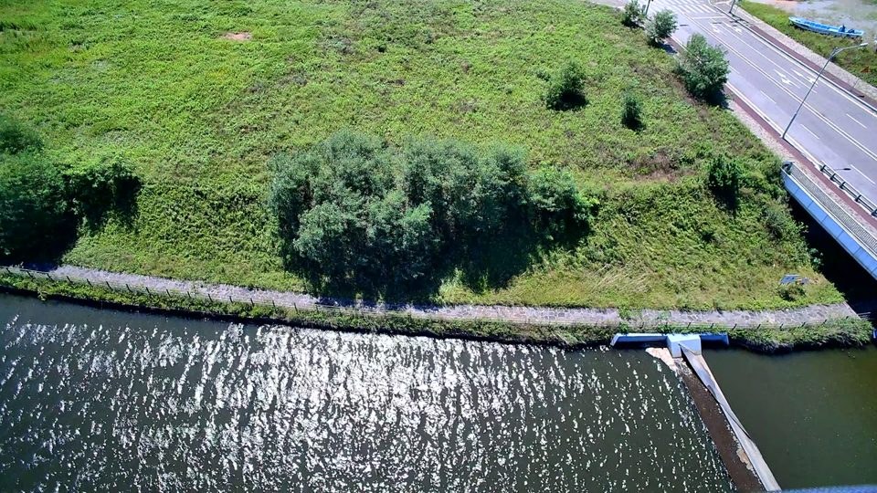
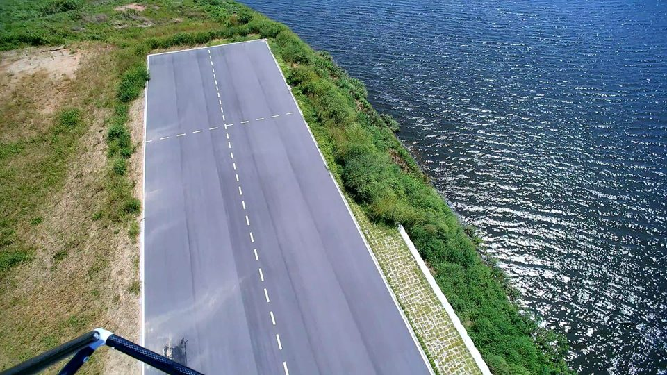
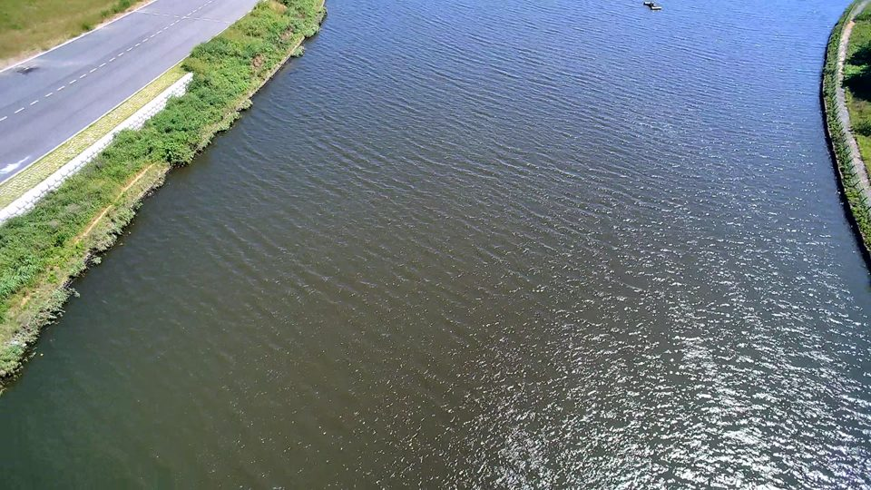

# UAV Reconnaissance Coverage

UAV 영상과 비행 텔레메트리로 **어디를 얼마나 관측했는지**, **다음 쏘티에서 어디를 더 관측해야 하는지** 확인하는 로컬 분석 도구입니다. 관측 횟수·해상도(GSD)·선명도·재관측 간격을 격자별로 계산하고 실제 위성지도 위에 표시합니다.

## 설치 없이 예제 확인

1. **Code → Download ZIP**으로 내려받고 압축을 풉니다.
2. `examples/dangjin/report.html`을 브라우저로 엽니다.
3. 격자를 클릭하거나 촬영 후보의 **위치 보기**를 누릅니다. 전체 관측 범위는 **추가 관측 필요 영역만** 체크를 해제하면 보입니다.

Python과 원본 영상은 필요 없습니다. 위성지도 배경만 인터넷 연결이 필요하며, 오프라인에서도 격자와 수치는 표시됩니다. GitHub 파일 화면에서는 HTML이 실행되지 않으므로 다운로드 후 열어주세요.

### 실제 비행 예제 사진

2026-09-04 당진 UAV7 비행에서 추출했습니다. 격자 대표 영상으로 가장 많이 선택된 3장을 표시용으로 960px 이하로 축소하고 EXIF를 제거했습니다.





전체 분석 격자와 촬영 후보는 수록하지만 사진은 3장만 포함합니다. 해당 사진이 연결되지 않은 격자는 수치만 표시합니다. 원본 MP4·텔레메트리는 포함하지 않습니다. 축소 사진은 원본 품질 재계산용이 아닙니다.

| 예제 지표 | 면적 |
|---|---:|
| 임시 분석영역 | 98,825 m² |
| 한 번 이상 관측 | 74,225 m² |
| 품질 기준 충족 관측 | 53,925 m² |
| 반복·방향 기준까지 충족 | 43,350 m² |
| 미관측 | 24,600 m² |
| 품질 부족 | 20,300 m² |
| 반복·방향 부족 | 10,575 m² |

관측/품질/반복 충족 면적은 서로 포함 관계입니다. 임시 분석영역은 관측 범위에서 만든 경계이므로 임무 전체 완료율을 뜻하지 않습니다.

## 내 비행 데이터 분석

Python 3.10 이상과 FFmpeg/ffprobe가 필요합니다. Windows에서는 `run.bat`을 실행하면 Python을 찾고 필요한 numpy/Pillow를 설치한 후 웹 화면을 엽니다. 새 분석 화면에서 쏘티 폴더를 선택하세요. 실행 파일을 직접 지정하려면:

```powershell
.\run.ps1 -Python "C:\Python312\python.exe" -FFmpegDir "C:\ffmpeg\bin"
```

다른 운영체제 또는 수동 실행:

```sh
python -m venv .venv
# Windows: .venv\Scripts\activate / macOS·Linux: source .venv/bin/activate
python -m pip install -r reconnaissance/requirements.txt
python -m reconnaissance.web --port 8780
```

브라우저에서 `http://127.0.0.1:8780`을 엽니다. 첫 화면의 **예제 지도 열기**는 분석 데이터가 없어도 동작합니다.

입력은 이 프로젝트가 지원하는 쏘티 형식의 `sortie-meta.json`, `telemetry.jsonl`, 메타데이터에 기록된 원본 MP4 한 세그먼트입니다. 임의의 사진 폴더나 일반 드론 로그는 바로 호환되지 않습니다. 카메라 보정값·촬영 시각·GPS·AGL·기체/짐벌 자세가 필요합니다.

명령행 분석 및 임무영역 지정:

```sh
python -m reconnaissance.analyze "path/to/sortie" --output analysis/my-sortie --aoi mission.geojson
```

`mission.geojson`은 WGS84 Polygon/MultiPolygon입니다. 생략하면 임시 분석영역을 사용합니다. `--help`에서 품질·재관측 기준을 확인하세요. 결과는 출력 폴더의 `report.html`, `coverage.csv`, `coverage.geojson`, `next_views.geojson`, `summary.json`에 저장됩니다.

## 해석과 연구 근거

빨강은 미관측, 주황은 품질 부족, 파랑은 반복·방향 부족, 초록은 설정 기준 충족입니다. 다음 촬영 후보는 부족 면적을 줄이는 우선순위 위치이며 비행 경로가 아닙니다. 평탄 지면·카메라 보정·시간 동기에 의존하며 지형/건물 가림과 비행 안전 제약은 계산하지 않습니다.

[분석 방법과 참고 논문](docs/RECONNAISSANCE_METHOD.md)에 수식, 기준, 원 논문과 구현의 차이 및 검증 한계를 정리했습니다.

## 개발 및 구성

- `reconnaissance/analyze.py`: 영상·텔레메트리 분석과 격자/후보 생성
- `reconnaissance/geometry.py`: 좌표 투영과 회전
- `reconnaissance/web.py`: 로컬 웹 화면과 분석 실행
- `reconnaissance/report.html`: 보고서 생성용 템플릿 (직접 열지 않음)
- `examples/dangjin/`: 바로 열 수 있는 예제 보고서·사진·결과
- `run.bat`, `run.ps1`: Windows 실행 진입점

```sh
python -m unittest discover -s reconnaissance -p "test_*.py"
python -m reconnaissance.package_example analysis/my-sortie --output examples/my-demo
```

로컬 원본과 분석 캐시는 Git에서 제외합니다. 저장소는 비공개이므로 다른 사용자가 접근하려면 협업자로 초대하거나 다운로드한 예제를 전달해야 합니다.
