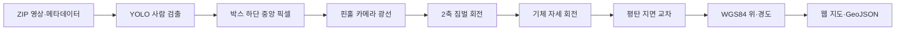

# UAV 영상 기반 사람 위치추정의 수학적 모델과 코드 검증

## 1. 구현 범위

이 프로그램은 UAV 영상에서 사람을 검출하고, 검출 픽셀과 촬영 시점의 UAV·2축 짐벌 메타데이터를 이용해 지상 위치를 계산한다. 기하 모델은 Kim et al. (2025)의 식 (1)~(3), (11)~(14), (18)을 단일 프레임에 적용한다.

논문의 능동 짐벌 제어, CSRT 추적, 동일 표적의 시간 연계, unicycle 운동 모델, EKF와 UKF는 구현하지 않는다. 출력은 프레임별 **관측 위치**이며 필터링된 표적 궤적이나 고유 인원 수가 아니다.

## 2. 좌표계와 기호

논문은 이륙점을 원점으로 하는 NED 관성좌표계 $F_I$, 이와 평행하게 UAV를 따라 이동하는 vehicle-carried frame $F_V$, 기체좌표계 $F_B$, 카메라와 결합된 짐벌좌표계 $F_G$를 사용한다. NED 벡터의 성분은 북쪽 $N$, 동쪽 $E$, 아래쪽 $D$이다. 카메라/짐벌 좌표축은 전방 $x$, 우측 $y$, 하방 $z$의 FRD로 둔다.

| 논문 기호 | 코드 항목 | 단위 |
|---|---|---|
| $\phi_0,\lambda_0$ | `latitude`, `longitude` | degree |
| $h$ | `altitude_agl` | metre |
| $\phi,\theta,\psi$ | `roll`, `pitch`, `yaw` | radian |
| $\lambda,\nu$ | `gimbal_pitch`, `gimbal_yaw` | degree → radian |
| $f_x,f_y,c_x,c_y$ | camera 설정 | pixel |
| $u,v$ | `pixel_4k` | pixel |

짐벌은 pan-yaw와 tilt-pitch의 2축이며 roll 축은 사용하지 않는다.

## 3. 사람 검출점

YOLO11n은 영상을 1024×1024 pixel 타일로 처리한다. 타일 간격은 768 pixel이므로 256 pixel이 겹치며, COCO `person` 클래스만 검출한다. 중복 박스는 신뢰도 순 IoU 0.45 NMS로 제거한다.

검출 박스가 $(x_{min},y_{min},x_{max},y_{max})$일 때 사람과 지면의 접점은

$$
u=\frac{x_{min}+x_{max}}{2},\qquad v=y_{max}
\tag{A1}
$$

로 근사한다. 앉거나 가려진 사람은 웹 화면에서 접점을 직접 수정해야 한다.

## 4. 논문 식 (1): 기체 자세 회전

기체좌표계의 단위벡터를 $F_V$에서 표현하는 3-2-1 Euler 회전은

$$
\mathbf R_B^V(\phi,\theta,\psi)
=\mathbf R_z(\psi)\mathbf R_y(\theta)\mathbf R_x(\phi)
\tag{1}
$$

이다. 코드의 `rotation(yaw,2) @ rotation(pitch,1) @ rotation(roll,0)`과 일치한다.

## 5. 논문 식 (2): 2축 짐벌 회전

논문에서 pan은 $\nu$, tilt는 $\lambda$이다. 짐벌좌표계의 단위벡터를 기체좌표계에서 표현하는 회전은

$$
\mathbf R_G^B(\nu,\lambda)
=\mathbf R_z(\nu)\mathbf R_y(\lambda)
\tag{2}
$$

이다. 코드에서는 $\nu=\texttt{gimbal\_yaw}$, $\lambda=\texttt{gimbal\_pitch}$로 대응한다.

## 6. 논문 식 (3): 결합 회전

논문의 기체와 짐벌 회전을 결합하면

$$
\mathbf R_G^V
=\mathbf R_B^V(\phi,\theta,\psi)\mathbf R_G^B(\nu,\lambda)
\tag{3}
$$

이다. 따라서 짐벌 $x$축 광축은

$$
\hat{\mathbf i}_g^I
=\mathbf R_G^V
\begin{bmatrix}1\\0\\0\end{bmatrix}.
\tag{4}
$$

## 7. 논문 식 (18)과 임의 픽셀 광선

논문 식 (18)의 핀홀 측정 관계를 코드의 픽셀 좌표로 쓰면

$$
s
\begin{bmatrix}
1\\ \Delta x_{pix}/f_x\\ \Delta y_{pix}/f_y
\end{bmatrix}
=\mathbf C_I^G
\begin{bmatrix}
x_t-x_b\\y_t-y_b\\h
\end{bmatrix}
+\boldsymbol\mu_k.
\tag{18′}
$$

$s$는 카메라 광축 방향 깊이이며 $\boldsymbol\mu_k$는 픽셀 잡음이다. 현재 코드는 필터의 잡음항을 사용하지 않고 검출 픽셀에서 다음 광선을 만든다.

$$
\mathbf r_G=
\begin{bmatrix}
1\\(u-c_x)/f_x\\(v-c_y)/f_y
\end{bmatrix}.
\tag{A2}
$$

NED 좌표계에서 광선은

$$
\mathbf d=
\mathbf R_z(\psi)\mathbf R_y(\theta)\mathbf R_x(\phi)
\mathbf R_z(\nu)\mathbf R_y(\lambda)
\mathbf r_G
=\begin{bmatrix}d_N\\d_E\\d_D\end{bmatrix}.
\tag{A3}
$$

행렬은 오른쪽부터 적용된다. 광선의 공통 스케일은 다음 단계에서 상쇄되므로 단위벡터 정규화는 필요하지 않다.

## 8. 논문 식 (11)~(14): 광선과 지면의 교차

논문 식 (11)은 UAV 위치 $\mathbf p_B$에서 광축 방향으로 진행하는 직선이다.

$$
\mathbf p_T=\mathbf p_B+\rho\hat{\mathbf i}_g.
\tag{11}
$$

NED에서 UAV와 지상 표적은 $\mathbf p_B=[x_b,y_b,-h]^T$, $\mathbf p_T=[x_t,y_t,0]^T$이므로

$$
\rho\hat{\mathbf i}_g
=\mathbf p_T-\mathbf p_B
=\begin{bmatrix}x_t-x_b\\y_t-y_b\\h\end{bmatrix}.
\tag{12}
$$

하방 단위벡터 $\hat{\mathbf k}^{I}$와 내적하면

$$
\rho=\frac{h}{\hat{\mathbf i}_g\cdot\hat{\mathbf k}^{I}}
\tag{13}
$$

이고 지상점은

$$
\mathbf p_T
=\mathbf p_B+
\frac{h}{\hat{\mathbf i}_g\cdot\hat{\mathbf k}^{I}}
\hat{\mathbf i}_g.
\tag{14}
$$

코드의 비정규화 광선 $\mathbf d$를 대입하면

$$
\Delta N=h\frac{d_N}{d_D},\qquad
\Delta E=h\frac{d_E}{d_D}.
\tag{A4}
$$

`core.py`의 `d * altitude_agl / d[2]`가 이 식이다. $d_D\le10^{-6}$이면 광선이 아래쪽 지면과 유효하게 교차하지 않는 것으로 처리한다. 지형 표고차 $\Delta h$가 같은 수직 기준으로 주어지면 $h$ 대신 $H=h-\Delta h$를 사용한다. 현재 코드는 $\Delta h=0$인 평탄 지면만 지원한다.

## 9. WGS84 위·경도 변환

WGS84의 장반경 $a=6378137\,\mathrm m$, 이심률 제곱 $e^2=6.6943799901413165\times10^{-3}$을 사용한다. UAV 위도 $\phi_0$에서 곡률반경은

$$
R_N=\frac{a}{\sqrt{1-e^2\sin^2\phi_0}},\qquad
R_M=\frac{a(1-e^2)}{(1-e^2\sin^2\phi_0)^{3/2}}
\tag{A5}
$$

이고 최종 위치는

$$
\phi_t=\phi_0+\operatorname{deg}\!\left(\frac{\Delta N}{R_M}\right),\qquad
\lambda_t=\lambda_0+\operatorname{deg}\!\left(\frac{\Delta E}{R_N\cos\phi_0}\right).
\tag{A6}
$$

이는 짧은 거리의 국소 접평면 근사이다. 논문의 평탄 지면 가정은 통상 이륙점에서 20 km 미만 운용을 전제로 한다.

## 10. 코드 검증 결과

| 검증 항목 | 결과 | 설명 |
|---|---|---|
| 기체 3-2-1 회전 | 일치 | 논문 식 (1)의 $R_zR_yR_x$ 구현 |
| 2축 짐벌 | 일치 | 논문 식 (2)의 $R_z(\nu)R_y(\lambda)$ 구현 |
| 픽셀 광선 | 일치 | 식 (18)의 핀홀 관계를 임의 픽셀로 확장 |
| 지면 교차 | 일치 | 논문 식 (11)~(14)와 대수적으로 동일 |
| 위·경도 변환 | 타당 | WGS84 국소 곡률반경을 사용한 추가 변환 |
| 사람 검출 | 부분 대응 | 논문의 Tiny-YOLO 대신 YOLO11n 사용 |
| 추적·짐벌 제어 | 미구현 | CSRT 및 폐루프 제어 없음 |
| EKF·UKF | 미구현 | 시간 필터와 폐색 예측 없음 |
| 왜곡·지형 보정 | 미구현 | 이상적 핀홀과 평탄 지면 가정 |

수식과 `core.py`의 단일 프레임 위치계산은 일치한다. 실제 정확도 평가에는 카메라 캘리브레이션, 렌즈 왜곡, 카메라-짐벌 보어사이트, 센서별 축·부호, 시간 동기, AGL과 지형 표고의 실측값이 필요하다.

## 11. 정량 정확도 평가

RTK 또는 측량 기준점 $(N_i^{ref},E_i^{ref})$이 있을 때 각 관측의 수평오차는

$$
e_i=\sqrt{(N_i-N_i^{ref})^2+(E_i-E_i^{ref})^2}.
\tag{A7}
$$

평균, 중앙값, RMSE, 95백분위수와 최대값을 보고하고 비행 고도, 표적 거리, 짐벌 하향각, 영상 위치별로 나누어 평가한다. $d_D$가 작아지는 저각 촬영에서는 각도·픽셀 오차가 크게 증폭된다.

## 참고문헌

Kim, J., Kim, Y., Kim, S., Cho, H., & Jung, D. (2025). Vision-Based Geolocation of Moving Ground Targets Using Kalman Filtering with a Gimbal Camera on Board a UAV. *Aerospace, 12*(12), 1065. https://doi.org/10.3390/aerospace12121065
